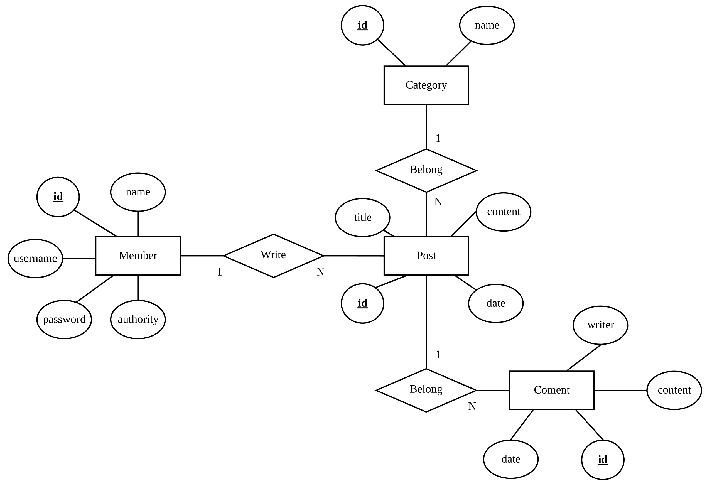
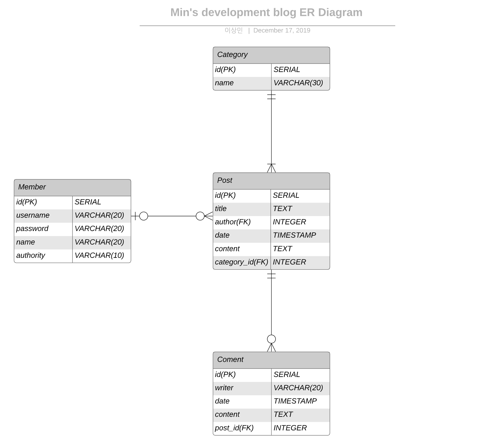

# 1차 DB 설계

## 개념적 ER 모델



## 물리적 ER 모델



## 구현

### MEMBER

* Create

  ```sql
  create table MEMBER (
    id serial primary key,
    username varchar(20),
    password varchar(20),
    name varchar(20),
    authority varchar(10)
  );
  ```

  ```sql
  insert into MEMBER (username, password, name, authority)
  values ('nalsm98', 'leesm0518!', '이상민', 'ADMIN');
  ```

### CATEGORY

* Create

  ```sql
  create table CATEGORY (
    id serial primary key,
    name varchar(30)
  );
  ```

  ```sql
  insert into CATEGORY (name)
  values ('Main');
  ```

### POST

* Create

  ```sql
  create table POST (
    id serial primary key,
    title text,
    author integer,
    date timestamp,
    markdown_content text,
    html_content text,
    category_id integer,
    foreign key (author) references member (id),
    foreign key (category_id) references category (id)
  );
  ```

### COMMENT

* Create

  ```sql
  create table COMMENT (
    id serial primary key,
    writer varchar(20),
    date timestamp,
    content text,
    post_id integer,
    foreign key (post_id) references post (id)
  );
  ```

  